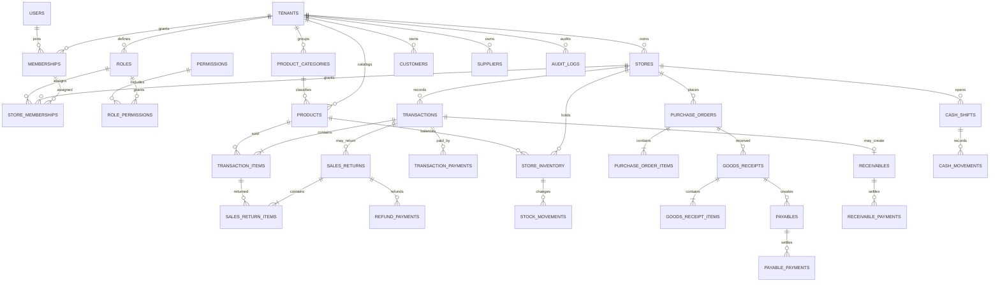

# Multi-Tenant Database Design

This schema replaces browser `localStorage` and the local JSON owner store. Its tables are implemented in the application migrations and validated against SQLite in memory. They have not been applied to the default project database because its connection is not configured.

## Decisions

- Use MySQL or MariaDB with InnoDB and `utf8mb4`.
- Use `BIGINT UNSIGNED` identifiers. Tenant-owned rows carry `tenant_id`; branch-scoped rows also carry `store_id`.
- Store Rupiah as integer `BIGINT` values. Store fractional stock quantities as `DECIMAL(14,3)`.
- Keep login identities global in `users`; grant tenant and branch access through membership records.
- Scope product catalog to a tenant. Keep stock balances and stock movements scoped to a store.
- Generate receipt numbers on the server from a locked per-store sequence, never from browser time.

## Entity Relationships

## Tables

| Table | Scope and important columns |
| --- | --- |
| `tenants` | `id`, `name`, `slug`, `status`, timestamps. Unique `slug`. |
| `stores` | `id`, `tenant_id`, `code`, `name`, `timezone`, `status`. Unique `(tenant_id,id)` and `(tenant_id,code)`. |
| `users` | `id`, normalized `email`, `name`, `password_hash`, `status`, `last_login_at`. Unique normalized email; never stores a plain password. |
| `roles` | `id`, `tenant_id`, `code`, `name`, `scope` (`tenant` or `store`). Unique `(tenant_id,id)` and `(tenant_id,scope,code)`. |
| `permissions` | Global immutable `code` primary key, description. Seed from application code. |
| `role_permissions` | `tenant_id`, `role_id`, `permission_code`; primary key `(tenant_id,role_id,permission_code)`. |
| `memberships` | `id`, `tenant_id`, `user_id`, optional tenant-wide `role_id`, `status`. Unique `(tenant_id,id)` and `(tenant_id,user_id)`. |
| `store_memberships` | `tenant_id`, `membership_id`, `store_id`, `role_id`, status. Unique `(tenant_id,membership_id,store_id,role_id)`. Owners receive a tenant-wide role; store staff receive explicit store assignments. |
| `product_categories` | `id`, `tenant_id`, `name`, optional parent category. Unique `(tenant_id,id)` and tenant-scoped category name/key. |
| `products` | `id`, `tenant_id`, `sku`, `name`, `unit`, `minimum_stock`, `cost_rupiah`, `retail_rupiah`, `wholesale_rupiah`, `status`. Unique `(tenant_id,id)` and `(tenant_id,sku)`. |
| `store_inventory` | `tenant_id`, `store_id`, `product_id`, `quantity`. Primary key `(tenant_id,store_id,product_id)`; current balance only, not the audit ledger. |
| `stock_movements` | `id`, `tenant_id`, `store_id`, `product_id`, signed `quantity_delta`, `unit_cost_rupiah`, source reference, actor, timestamp. Append-only; indexed by `(tenant_id,store_id,product_id,created_at)`. |
| `customers` | `id`, `tenant_id`, name, phone, status. Unique `(tenant_id,id)`. |
| `suppliers` | `id`, `tenant_id`, name, contact details, payment terms, status. Unique `(tenant_id,id)`. |
| `cash_shifts` | `id`, `tenant_id`, `store_id`, opening membership, open/close timestamps, opening/expected/count/cash-difference Rupiah amounts, status. |
| `transactions` | `id`, `tenant_id`, `store_id`, `receipt_no`, `cashier_membership_id`, optional `customer_id` and `cash_shift_id`, status, subtotal/discount/total Rupiah, timestamps. Unique `(tenant_id,store_id,receipt_no)`. |
| `transaction_items` | `id`, `tenant_id`, `store_id`, `transaction_id`, `product_id`, quantity, unit-price and cost snapshots, discount and line-total Rupiah. Preserves the exact sale lines for returns and reporting. |
| `transaction_payments` | `id`, `tenant_id`, `store_id`, `transaction_id`, method, amount Rupiah, reference. Multiple rows support split tender. |
| `sales_returns` | `id`, `tenant_id`, `store_id`, original `transaction_id`, return number, reason, status, approved-by membership, timestamp. Unique `(tenant_id,store_id,return_no)`. |
| `sales_return_items` | `id`, `tenant_id`, `store_id`, `sales_return_id`, original `transaction_item_id`, quantity, amount Rupiah. Quantity cannot exceed the unreturned original quantity. |
| `refund_payments` | `id`, `tenant_id`, `store_id`, `sales_return_id`, method, amount Rupiah, reference. |
| `purchase_orders` | `id`, `tenant_id`, `store_id`, `supplier_id`, order number, status, expected date, total Rupiah. Unique `(tenant_id,store_id,order_no)`. |
| `purchase_order_items` | `id`, `tenant_id`, `store_id`, `purchase_order_id`, `product_id`, ordered quantity and cost snapshot. |
| `goods_receipts` | `id`, `tenant_id`, `store_id`, `purchase_order_id`, receipt number, received-by membership, status, timestamp. |
| `goods_receipt_items` | `id`, `tenant_id`, `store_id`, `goods_receipt_id`, `product_id`, received quantity and unit-cost snapshot. Posting a receipt creates stock movements and balance updates. |
| `receivables` | `id`, `tenant_id`, `store_id`, optional `transaction_id`, `customer_id`, original amount, due date, status. Supports both sale credit and manual receivable. |
| `receivable_payments` | `id`, `tenant_id`, `store_id`, `receivable_id`, amount, method, received-by membership, timestamp. |
| `payables` | `id`, `tenant_id`, `store_id`, optional `goods_receipt_id`, `supplier_id`, original amount, due date, status. Supports both received purchases and manually entered payable. |
| `payable_payments` | `id`, `tenant_id`, `store_id`, `payable_id`, amount, method, paid-by membership, timestamp. |
| `cash_movements` | `id`, `tenant_id`, `store_id`, optional `cash_shift_id`, direction, category, method, amount Rupiah, reference, actor, timestamp. Expenses and cash-in/out movements use this ledger. |
| `audit_logs` | `id`, `tenant_id`, optional `store_id` and actor membership, action, entity type/id, redacted JSON details, timestamp. Append-only. |
| `report_archives` | `id`, `tenant_id`, `store_id`, period, generated-by membership, immutable JSON snapshot and timestamp. Unique `(tenant_id,store_id,period)`. |
| `receipt_sequences` | `tenant_id`, `store_id`, business date, next number. Unique `(tenant_id,store_id,business_date)` and locked when issuing a receipt. |

## Isolation Constraints

- Add `UNIQUE (tenant_id,id)` to every tenant-owned parent referenced by a composite foreign key.
- Every child reference to tenant-owned data uses the tenant in its foreign key, for example `(tenant_id,store_id,transaction_id)` to `transactions` and `(tenant_id,product_id)` to `products`.
- Use a composite role key that includes `scope`; `memberships` may reference only tenant-scope roles, while `store_memberships` may reference only store-scope roles. Enforce this with scoped composite foreign keys (or separate tenant/store role tables), not just UI checks.
- Store-scoped child rows reference `(tenant_id,store_id)` to `stores`; a store ID from another tenant must fail at the database layer.
- Index tenant-scoped lookup paths, typically `(tenant_id,store_id,created_at)` for transactions and movements.
- Derive tenant and permitted stores from the authenticated membership session. Never accept tenant scope from a form, query string, or client-side role selector.
- A shared `TenantModel` may apply tenant scoping as defense in depth, but services must also authorize the active membership and store. Database constraints remain mandatory.
- Seed permission codes such as `pos.sell`, `pos.void`, `product.manage`, `stock.view`, `stock.adjust`, `purchase.receive`, `finance.view`, `finance.manage`, `cash.manage`, `report.archive`, and `user.manage`. Check permissions in both route filters and the service/controller performing the operation.
- Add automated isolation tests for every endpoint: a tenant A user must not read, update, delete, or reference tenant B rows, including by substituting IDs in nested transaction and stock requests.

## Transaction Invariants

1. Checkout starts a database transaction and locks each affected `store_inventory` row with `SELECT ... FOR UPDATE`.
2. Reject the checkout if any resulting balance would be negative.
3. Insert the transaction, item snapshots, payment rows, stock movements, inventory balance updates, receivable if needed, and audit event in the same database transaction.
4. Commit only after every write succeeds; otherwise roll back the entire checkout.
5. Purchase receipt posting follows the same rule for stock movements, inventory balances, payables, and audit events.
6. A return locks the original sale lines, rejects quantities already returned, and records refund, stock disposition/movement, and audit entries atomically.

## Migration Order

1. `20261001093000_CreateTenantIdentity`: tenants, stores, users, roles, permissions, memberships, and store memberships.
2. `20261001093001_CreateTenantRetailOperations`: catalog, customers/suppliers, inventory ledger, shifts, sales, payments, returns, and refunds.
3. `20261001093002_CreateTenantFinanceAndAudit`: purchase orders/receipts, receivables/payables, cash movements, audit logs, and report archives.
4. Configure a real database in `.env`, review the target database, then apply with `php spark migrate`.
5. Seed permissions and one explicitly isolated demo tenant; do not seed production credentials.